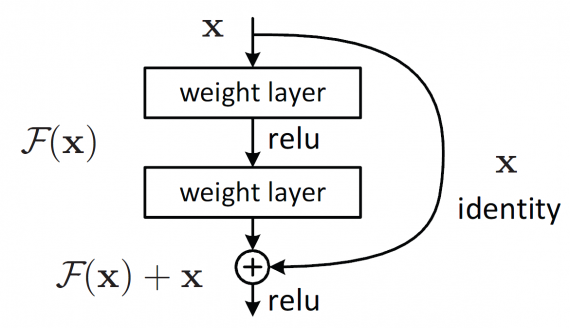

# Лабораторная работа 3

## Теоретические сведения.

Нейронные сети для классификации изображений работают по одному принципу. Сначала идёт несколько сверхточных слоёв и пулингов для выделения признаков из входного изображения, затем несколько полносвязных слоёв для классификации изображения по полученным признакам. 

<br>

В таких архитектурах различается архитектура сверхточных слоёв: <br>


**AlexNet** – одна из первых подобный сетей после LeNet, состоит из полносвязных слоёв и пулингов:
<br>
Использует функцию активации ReLU для решения проблемы затухания градиента.<br>

**VGG** – логическое продолжение идеи AlexNet в котором большие сверхточные слои  (15х15, 11х11) заменили на несколько подряд идущих слоёв с меньшем ядром:
<br>
Что привело к снижению количества обучаемых параметров. <br>

**RasNet** – состоит из n блоков вида:
<br>
Делается это для решения проблемы затухания градиента.<br>

**MobileNet** – архитектура разработанная для малопроизводительных устройств:

<br>

Особенностью данной архитектуры является отсутствие max pooling-слоёв. Вместо них для снижения пространственной размерности используется свёртка с параметром stride, равным 2.

<br>


## Описание разработанной системы

Все использование модели обучались на датасете Imagenet, следовательно преобразования входных изображений для них одинаковые и взяты из документации:
```python
image_transforms = transforms.Compose([
        transforms.Resize((224, 224)),
        transforms.ToTensor(),
        transforms.Normalize([0.485, 0.456, 0.406], [0.229, 0.224, 0.225])
        ])
```
Тестовый датасет загружается из выбранной папки и размечается в соответствии с названия вложенной папки в котором находится изображение, для этого модифицируется  torchvision.datasets.ImageFolder:
```python
class ImageFolderWithPaths(torchvision.datasets.ImageFolder):
    def __getitem__(self, index):
        original_tuple = super(ImageFolderWithPaths, self).__getitem__(index)
        labels = self.imgs[index][0].split('/')[-1].split('\\')[0]
        return (original_tuple[0], int(labels), self.imgs[index][0].replace("\\", "/"))
```
Используемое модели берутся из библиотеки torchvision, для использования уже обученных сетей в модель необходимо загрузить веса:
```python
model_resnet18 = models.resnet18(weights='ResNet18_Weights.DEFAULT').to(device)
```
Функция evaluationl выполняет обработки изображений из датасета используя полученную модель сети и возражает для каждого изображения: топ 5 классов и их вероятности, метки классов и адрес исходного изображения.
```python
def evaluationl(model):
    model.eval()     
    top_5_val, top_5_class, labels_list, paths_list = [], [], [], []
    for inputs, labels, paths in tqdm(test_dataloader):
        inputs = inputs.to(device)
        labels = labels.to(device)
        with torch.set_grad_enabled(False):
            preds = model(inputs)
        top = torch.torch.topk(preds, 5)
        top_5_class += top.indices.tolist()
        top_5_val += top.values.tolist()
        labels_list += list(labels)
        paths_list += list(paths)
    return top_5_class, top_5_val, labels_list, paths_list
```

Функция accuracy высчитывает и возражает Top1 и Top5 accuracy для модели:
```python
def accuracy(top_5_class, labels_list):
    top_1 = sum(map(lambda x, y: x[0] == y, top_5_class, labels_list)) / len(top_5_class) * 100 
    top_5 = sum(map(lambda x, y: y in x, top_5_class, labels_list)) / len(top_5_class) * 100
    return top_1, top_5
```
Функция main основная функция которая запускает обработку, засекает время выполнения и выводит статистику для модели, а также формирует словарь с результатами для каждого изображения:
```python
def main(model):
    start_time = time.time()
    top_5_class, top_5_val, labels_list, paths_list = evaluationl(model)    
    calc_time = (time.time() - start_time)
    result = {d : {'labels': c.tolist(), 'class_name': class_index_to_name[c.tolist()], 'top_5_class': a, 'top_5_val': b} for a, b, c, d in zip(top_5_class, top_5_val, labels_list, paths_list)}         
    print('Top_1: {:.2f}% Top_5: {:.2f}% Time: {:.3f} second'.format(*accuracy(top_5_class, labels_list), calc_time), flush=True)
    return result
```

Для удобства результат обработки изображениq можно представить в виде pandas таблицы и выгрузить:

```python
writer = pd.ExcelWriter('output.xlsx', engine='xlsxwriter')
for r in result.keys():
    result[r] = pd.DataFrame.from_dict(result[r]).T
    result[r].to_excel(writer, sheet_name=r)
writer.save()
```

## Результаты работы и тестирования системы 

В лабораторной работе исследовалось 5 моделей, на датасете из 100 изображений бананов и клубники. Датасет пред обрабатывался и подавался на вход модели, вычитывалось время обработки, объём памяти которую занимала программа и  Top1 и Top5 accuracy для каждой модели, получение данные приведены  в таблице: <br>

| Name_Model    | Top_1     | Top_5  | Time(second)   | Memory(MiB)|
| ------------- |:---------:| ------:| --------------:| ----------:|
| resnet50      | 99.00%    | 100.00%|  1.374         |  430.5     |
| resnet18      | 93.00%    | 99.00% |  0.908         |  375.6     |
| alexnet       | 85.00%    | 93.00% |  0.808         |  571.1     |
| mobilenet     | 96.00%    | 100.00%|  1.154         |  347.0     |
| vgg16         | 93.00%    | 98.00% |  2.063         |  864.3     |

Пред обработанные изображения выглядят следующим образом:  <br>
<br>

Результаты по каждому изображению и модели формируются в excel файл вида:<br>
<br>

Результат классификации одного изображения :<br>
<br>

## Выводы по работе
В лабораторной работе была реализована система классификации изображений и произведено сравнение 5 моделей сетей для классификации изображений. По итогу модно сделать выводы что все модели показали себя отлично на тестовом датасете. 
+ Alexnet – старая модель и поэтому показывает не столь хорошие результата, 
+ resnet – точность меняется в зависимости от количества блоков в модели, но соответственно меняется время работы и объём занимаемой памяти,
+ Mobilenet – показывает результат чуть хуже чем resnet, но и требует меньше ресурсов для работы.
+ Vgg – большая модель поэтому занимает много места и показывает большое время работы, но также показывает хорошие результаты.

## Источники 
- https://pytorch.org/vision/stable/models.html
- https://pytorch.org/vision/master/models/generated/torchvision.models.vgg16.html
- https://pytorch.org/vision/master/models/generated/torchvision.models.resnet18.html
- https://pytorch.org/vision/main/models/generated/torchvision.models.resnet50.html
- https://pytorch.org/vision/main/models/generated/torchvision.models.mobilenet_v2.html
- https://pytorch.org/vision/stable/models/generated/torchvision.models.alexnet.html

